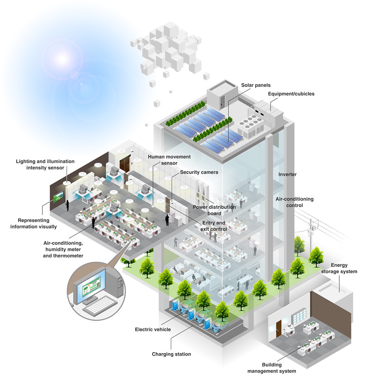
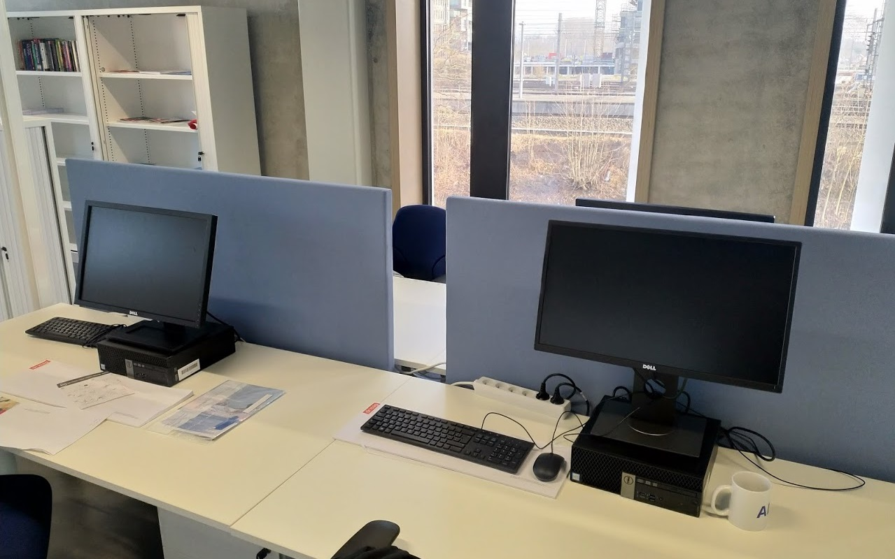
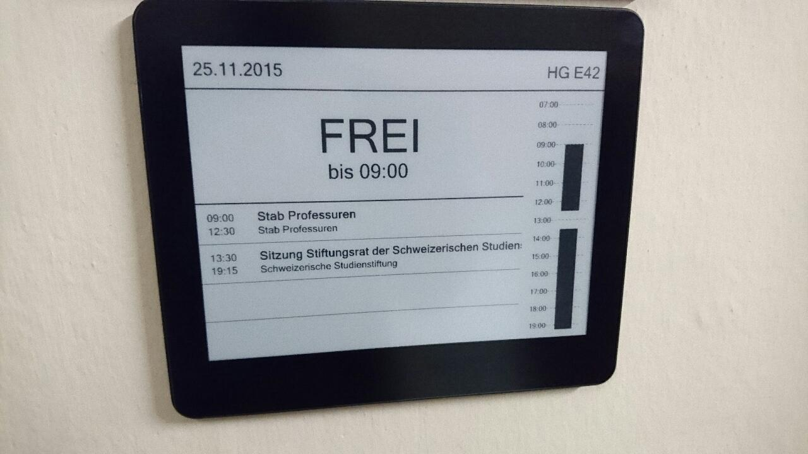

# VIVES Smart Campus using LoRaWAN

New technologies enable the connectivity of all kinds of sensors to the Internet. These practices create what is called the Internet of Things or IoT. In recent years some technologies enable simple sensors to be part of this Internet of Things. To be successful, the connectivity must be implemented with some restrictions. The Things must use a very low power, and they must be able to communicate over large distances.

LoRaWAN is a wireless technology that enables to build IoT solutions using Ultra Low Power sensors that can communicate over kilometers of distance. LoRaWAN enables to place multiple sensors to existing or new buildings like our campus, to measure and control various parameters. The ultra low power requirements make it possible to do this with small battery powered systems. No need to add new cables or use large and bulky batteries. No need to recharge the batteries on a daily, weakly or yearly basis. LoRaWAN should be able to last up to 5 or even 10 years using a couple of AA batteries.

To make things smarter you need a couple of basic components such as:

* sensors that capture data;
* a communication channel to a backend that stores and processes the data;
* a web application to visualize the data;
* logic that can act upon the gathered data.

In this project we will focus on the first three components as we do not have the necessary access to the controls of the building to implement the last.

## Low Power?

What is low power? This can be specific to the application. A 1kW motor on a cargo ship could be considered a 'low power' system. When speaking about the Internet of Things or small embedded systems 'low power' means something totally different. As a small rule of thumb, Embedded systems and Iot devices are split up in some categories.

* Power: any system where power is expressed in terms of **Amperes (A)** or **Watts (W)**
* Low Power: any system where power is expressed in terms of **milliamperes (mA)** or **milliWatts (mW)**
* Ultra Low Power: any system where power is expressed in terms of **microamperes (µA)** or **microWatts (µW)**

Do note that when talking about ultra low power devices, voltage is not a measure of low power. Think about the Intel core i9-7980XE being sourced at 1.35V but is able to draw hundredths of Watts. This is not a low power system in context of embedded devices.

## Making the Campus Smart(er)

Using LoRaWAN some aspects of the campus can be improved making it smarter. In this project some of these will be tackled.

### Room Occupation

For example using a **small PIR sensor**, it is possible to **track movement** in a room. In the more classical way this is used a lot to **automatically trigger lighting**. This is a closed system that does not expose any information to the outside world. Adding a LoRaWAN transmitter makes it possible to collect the data of any movement. This data in turn can be used to monitor or control other systems. For example if the PIR is triggered more than 10 times a minute, it can indicate that allot of people are present in the room, and that they stay in the room. If the sensor is only triggered a single time in an hour, it might be that somebody only passed by, not occupying the room.

It might be possible to count the heads with this kind of system, but in this case we are only interested in an **'indication'**. The PIR trigger rate will also be depending on the type and size of room.

#### Flex Desks

The same hardware solution, without any modification, could also be implemented to **measure occupation** of flex desks. This enables the system to monitor how many desks are occupied. All sorts of triggers could be used to optimize the collection of garbage, or when its (not) necessary to clean the desks.

### Room Quality

Some easy measurements could provide helpful information about the state of the rooms. Temperature and humidity could tell a lot about the **air quality conditions of a room**. The information collected by these sensors could trigger other systems like heating or air conditioning, making the campus smarter. It can prevent (in combination with the room occupation monitor) unnecessary heating or cooling of specific rooms. Abnormal values in humidity could also trigger ventilation or hint problems.

The room occupation solution could be easily extended with other sensors for temperature and humidity.

## Smart Signs

At a campus, the classrooms and labs continuously change their functionality depending on the schedule. Labeling these rooms with classical fixed systems would be cumbersome and inefficient. Today, Epaper (aka E Ink) displays could change the way the rooms are labeled. Using LoRaWAN, **new schedules and changes could be communicated to these** display over the air. Epaper displays only use a small amount of power when changing the pixels. When done, the display can be powered off completely and it will keep displaying the content on the screen. Thus again enabling a system not to use any cabling and be fully powered using batteries.

The classrooms and labs could be equipped with displays showing the current occupation, and schedule for the day or week.

The hallways can also be equipped with these kind of displays that are used as a digital signage system. They can provide useful information to visitors and students. For example if a workshop or event is organized it can show arrows to send people to the correct location.

## Monitoring and Management

All the hardware systems summed up above would be useless if the data they produce disappears in thin air. A monitoring system must be provided. All data and parameters should be stored in a **database**, and a graphical user interface should be able to visualize the data in different and useful ways, like **charts and graphs**.

On the other hand the smart signs should be able to be **managed** on this system. Adding, or changing schedules for classrooms could easily be done with this system. Updating the signs with new information should be done on an automatically timed process, **preventing the need of human intervention**.

The application should also provide a **generic dashboard** that presents useful information to all the users of the campus.

