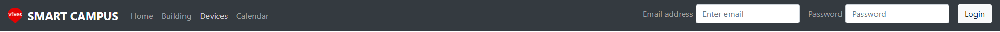
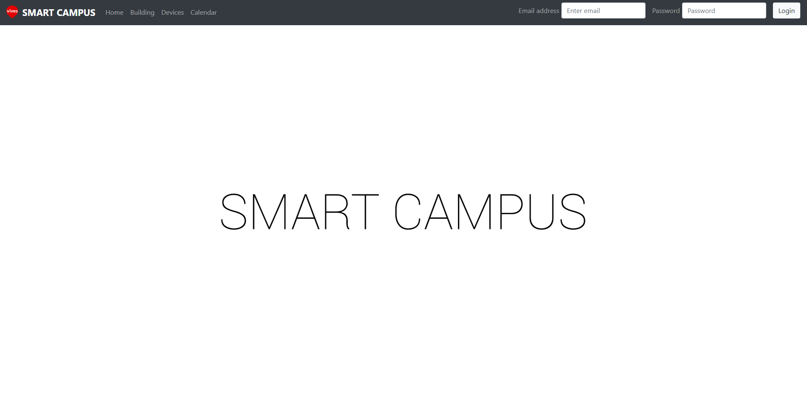
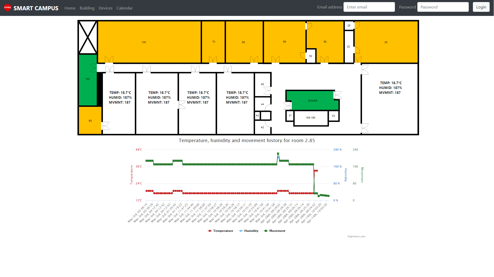
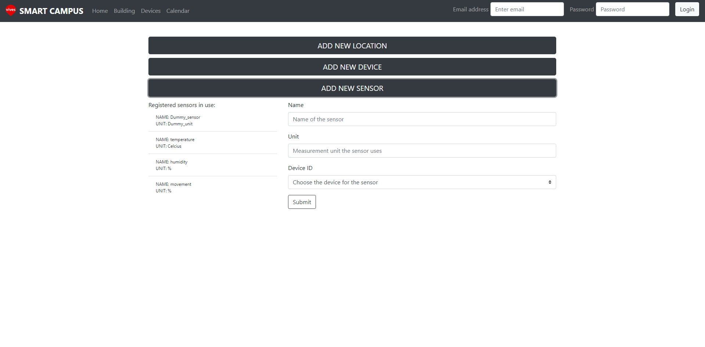

# Frontend

## Used technologies

It was suggested in the Software Design page of the assignment information that the frontend should be written in JavaScript. I was already familiar with node-js and with its REACT.js framework so I used these.

The biggest advantage of REACT.js is the sheer amount of useful third-party libraries and components that are free to use without any licensing issues. Having to design an interactive floor plan I found a component called react-image-mapper \([https://www.npmjs.com/package/react-image-mapper](https://www.npmjs.com/package/react-image-mapper)\). Highcharts \([https://www.highcharts.com](https://www.highcharts.com/)\) was used for displaying the historical values. Bootstrap \([https://getbootstrap.com](https://getbootstrap.com/)\) provided the necessary UI elements like forms, selectors, buttons and also the layout. Router \([https://github.com/ReactTraining/react-router](https://github.com/ReactTraining/react-router)\) was needed to set up separate router for the individual components so that they wouldn't collide in any way. Momentjs \([https://momentjs.com](https://momentjs.com/)\) was also used for time displaying formatting.

## Design

I tried to keep the overall design of the application as minimalistic and material as possible. I chose a cold color scheme with the noticeable exception being the floor plan which uses vivid color like orange to stand out from the rest of the app.

The application is designed for computers. I did not focus on the mobile design because of problems with the react-image-mapper component which did not behave correctly on small devices.

### Navigation

I chose to use the navigation bar that is available in Bootstrap. As with all of its components Bootstrap provided easy customizability. Everything but the login form is pinned to the left side. The VIVES logo and Smart Campus text are clickable and send the user back to the homepage. The other left-sided links send the user to the correct route.

The login form already had text detection implemented so it requires an email and a password to let the user send the data through. For the login button, I didn't have it detect keystrokes so hitting the enter key on the keyboard does not trigger it.



### Page layouts

#### Home

The homepage only contains a background image stating the name of the application. I didn't find it necessary to include anything else.



#### Building

The Building route contains the floor plan which was created by the react-image-mapper component. Active rooms have the measured real-time values of the temperature, humidity and movement displayed over them. Clicking on a room opens the historical data of those measured values in a form of a graph.



#### Devices

The Devices route contains three buttons that stretch through the upper-center part of the screen. Upon clicking on one of them the list of currently active devices/sensors/locations is displayed on the left and the form for adding a new one is on the right.



#### Calendar

This route was abandoned because of time constraints in the hardware development part of the project.

## Code

### Building

The image-mapper component was straight-forward to create. It's basically an .svg image that has areas mapper over it. The areas are determined by the current width of the browser window to be adjustable. I wasn't able to make the whole image adjustable like that without the need for a page refresh \(which in turn made it impossible to display the graph\), so I did not make it so. After changing the size of the browser window the user has to manually refresh the page for the component to change size.

```javascript
<ImageMapper
    src={require("../img/floor_plan.svg")} // the visual of the plan
    id="map"
    width={this.state.width * 0.7} // width adjustable based on browser window width
    map={this.state.MAP} // the areas mapped on the plan
    fillColor={"rgba(141, 128, 229, 0.3)"}
    onClick{(this.state.MAP.areas, this.click_handle)} // action on clicking an area
/>
```

The function for setting the areas that are mapped on the floor plan needed to be calculated precisely. By knowing the exact measurements of the rooms in the floor plan it was easy to set them correctly using the width parameter that updates every time the browser window is resized.

The data displayed over the individual rooms are just text elements of HTML. As with the areas on the plan they needed to be positioned manually with calculations depending on the width of the browser window. During the rendering of the site a function is called for each of the datatypes \(temperature, humidity and movement\).

```javascript
temp_style() {
    var temp = []; // will hold the styling for the element
    var arr = []; // will hold the element
    var margin = 0.072;
    
    for (var i = 0; i < 5; i++) { // because we have 4 active rooms
        temp[i] = { position: 'absolute',
                    top: this.state.width * 0.15,
                    left: this.state.width * margin,
                    'fontSize': this.state.width * 0.007,
                    'fontWeight': 'bold'
                    };
        margin = margin + 0.079; // same margins in the first 4 rooms
        if (i === 4) { // the last room is has a different position altogether
            temp[i] = { position: 'absolute',
                        top: this.state.width * 0.15,
                        left: this.state.width * margin,
                        'fontSize': this.state.width * 0.007,
                        'fontWeight': 'bold'
                        };
        }
        if (this.state.temp_data[i] !== undefined) {
            arr[i] = <span style={temp[i]}>
                        TEMP: {this.state.temp_data[i].value + "°C"}
                    </span>
        }
    }
    
    return arr; // returning the span element to be displayed
}
```

The graph is displayed when the user clicks on any of the active rooms. Graph is invisible when the page is rendered and is made visible when user click on the plan.

```javascript
componentDidMount() { // making the graph invisible on render
    ...
    document.getElementById("chrt").style.display = "none"; // making it invisible
    ...
}

click_handle() { // called when user clicks on a room on the plan
    document.getElementById("chrt").style.display = "initial"; // making it visible
    this.setState({ area }); // info for the room number displayed in graph name
    this.setState(this.state.data); // update the data
}
```

### Devices

The buttons are displayed and are reactive on clicking. When clicked a function is called and the form and currently registered devices/locations/sensors are visible.

```javascript
<button type="button" 
        className="btn btn-dark btn-lg btn-block toggle_btns" // style information
        onClick={this.toggle_loc.bind(this)}> // function bound to button click
        ADD NEW LOCATION // the text on the button
</button>
{!this.state.loc_btn_hidden && <LocForm />} // form invisible until button click
```

Upon rendering the site the form and list of currently registered stuff is hidden. Clicking one of the button makes the respective data visible.

```javascript
toggle_loc() { // called on button click, makes form visible
    this.setState({ loc_btn_hidden: !this.state.loc_btn_hidden });
}
```

The registered data is displayed in lists and it is generated when the site is rendered. The data for each of the categories \(devices, sensors and locations\) is saved in the state of the component. It is then displayed when the corresponding function is called. The same can be said about the form. For the devices and sensors forms the last of the inputs is a single select that has the values of the respective higher level data loaded and available.

```javascript
locations() { // generates data for the single select element
    var arr = []; // stores the options for the element
    
    for (var i = 0; i < this.state.locs.length; i++) {
        arr[i] = <option key={i} // one of the options in single select
                        value={this.state.locs[i].id}>
                        {this.state.locs[i].name}
                </option>
    }
    
    return arr; // returning the data for the single select elements
}
```

```javascript
active_locs() { // generates the list of registered locations
    var arr = [];
    
    for (var i = 0; i < this.state.locs.length; i++) {
        arr[i] = (<li className="list-group-item" // styling
                        data-toggle="tooltip" // displaying tooltip on hover
                        data-placement="bottom"
                        title={this.state.locs[i].description} // content of tooltip
                        key={i}>
                        <div>NAME: {this.state.locs[i].name}</div>
                        <div>ROOM: {this.state.locs[i].roomnumber}</div>
                    </li>);
    }
    
    return arr; // returning the list of registered locations
}
```

On clicking the submit button under the form for registering a new device a function with a post request is triggered. The post request was done with the help of the axios third-party component that uses promises.

```javascript
submit_location() {
    var loc_name = document.getElementById("loc_name").value; // getting values from components
    var loc_num = document.getElementById("loc_num").value;
    var loc_desc = document.getElementById("loc_desc").value;
    
    axios.post(BACKEND_URL + "/api/locations", { // setting the url to post to
        "name": loc_name,
        "roomnumber": loc_num,
        "description": loc_desc
    })
        .then(function (response) { // logs the response code of the request
            console.log(response);
        })
        .cath(function (error) { // logs the error code
            console.log(error);
        });
}
```

### Data

I used the axios third-party component for the get requests. They are done using promises. Due to the structure of the data I had to get data for each room separately. All of temperatures, humidity and movement data for one room was available through one get request. The sensors, devices and locations needed separate functions as well.

```javascript
function getData265() { // getting data for room 2.65
    return new Promise((resolve, reject) => { // starting a new promise
        axios.get(BACKEND_URL + "/api/locations/room/2.65") // url with data
            .then(results => {
                const sensor_data = results.data;
                resolve(sensor_data); // returning the data
            })
            .catch(error => {
                console.log(error); // logging the error
                reject(); // interrupting the get request
            })
    });
}
```

## Conclusion

Due to time constraints I was not able to finish all functions that were set in the assignment. The application is not fully responsive to window resizing and it was not designed for mobile devices. These issues could be easily resolved with more work though. Other than these I would say the application is in a decent state.

During the presentation of the project I was told there was a requirement for a sort of management component. However, in the official assignment the only mention of anything like this was the schedule component that would be used in the calendar route. I abandoned this after due consideration because the hardware was abandoned and I was told by the teacher that it is now unnecessary to implement this.

You can find all of my code here: [https://github.com/Projectwerk2-2018/smart-campus-frontend](https://github.com/Projectwerk2-2018/smart-campus-frontend)

