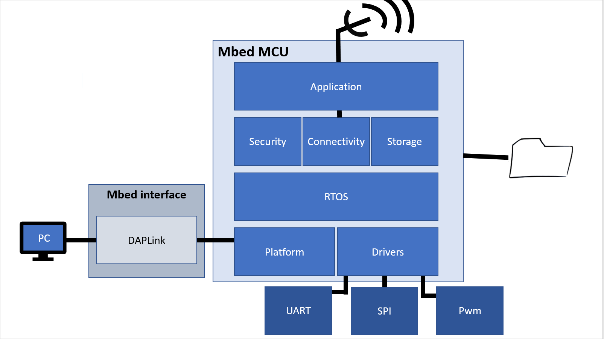

# Hardware Design

The non-limited list of tasks of the hardware designers consists of the:

* development of a prototype using a processor and sensor boards;
* development of a custom battery powered PCB;
* development of the **mBed device drivers**;
* integration of the mBed firmware in **mBed OS**;
* communication with the software development team using the Agile **SCRUM** Software Development Methodology.

## Prototype

In an early stage, a fast proof-of-concept must be build using a prototype design. This design can be build using existing processor boards, breakout sensor boards and other pre-made hardware. This design will serve as a platform to test and develop firmware. In the next stage, a custom PCB with all the components must be build.

Our pcb, \(designed by Gain Gary and Bonne Robbe\) is made in the recommended software CircuitMaker. Afther a long time of searching how the whole program works, started I \(Bonne Robbe\) to design a schematic and board just to test the temperature/humidity sensor \(si7013Atum20\). This because the sensor is too small to test it on a breadboard.

The schematic:  

the board:

## Custom PCB

In the next stage, a custom PCB must be build using only the essential components. The PCB must also make use of battery power to operate, and must be optimized to run as long as possible. PCB's can be ordered online using a service like [http://www.allpcb.com/](http://www.allpcb.com/) or an alternative service.

The PCB can be designed using the design software of your preference. We recommend [CircuitMaker](https://circuitmaker.com/), but [Eagle](https://www.autodesk.com/products/eagle/overview) is also a good option.

For the design of the custom PCB I \(Lennert Bogaert\) used the recommend software CircuitMaker.

Afther the works I \(Robbe\) did on the temp/hum sensor and the schematic was ready. Started Gary and I the designing of the pcb itself.

The board with all layers:

* Crystal for usage without internal clock​ 32KHz \(X1\)
* Test pins above to deactivate the voltage regulator for testing​
* cut-outs around the temp/hum sensor to avoid extra heat from components nearby
* Placed the voltage regulator far away from the temp/hum sensor to avoid extra heating.
* Resistors/capacitors all 0805​
* Power TEMP/HUMI and Power PIR1 are able to swith by a resistor pad so If they are not needed or don’t work its possible to switch them off​
* Antenna trace width is 1mm thick. Smaller traces would result in a bad impedance matching             \(50 ohms\). What would make the antenna inefficient, or even unable to work at all.​
* We also have an extra crystal on it to stabilize usb connection \(Y1,8MHz\).

Board lay-out as seen from the bottom layer:

* Testpins for programming µC​ are those in the left corner containing NRST,DIO1,TCK and TMS pin.
* Testpins above connected with the uart of the µC to read from it. Via those pins it is able to check the data from the temp/hum sensor or PIR.
* Putted them togheter with the reset button on the bottom layer to test/reset it when its in his case. 

## mBed device drivers

The mBed device drivers should be developed according to the Object Oriented Paradigm \(OOP\), for instance in C++. As a good software developer you should create abstractions for all hardware. For each device that will be interfaced by the mBed, the driver software should be based on at least one **class**. A recommended approach is to divide the software in at least three sections: the **interface** \(e.g. GPSmodule.h\), the **implementation** \(e.g. GPSmodule.cpp\) and **application** \(e.g. GPStest.cpp\) \(see **image below**\).

## Integration of the mBed firmware in mBed OS

ARM mBed OS is an open source embedded operating system designed specifically for the "things" in the Internet of Things \(see **image below**\). It includes all the features you need to develop a connected product based on an ARM Cortex-M microcontroller, including security, connectivity, an RTOS \(Real-Time Operating System\) and drivers for sensors and I/O devices.

More info about mBed OS can be found at [https://os.mbed.com/](https://os.mbed.com/).

## Total cost

made by Robbe

**Total: 160€**

made by Gary

made by Joni

