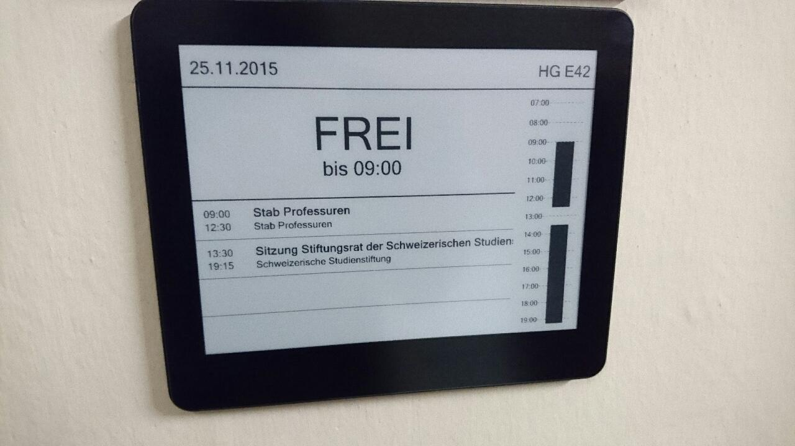

# Hardware Requirements

Multiple hardware systems must be build. 1. Occupation detector 2. Temperature and humidity monitoring 3. Smart signs

Designing and developing these systems must be done in an **incremental process**. Start by using development boards, breadboards and sensors to create a basic prototype. This enables to do small experiments and allows the writing of firmware. Parallel a custom PCB can be developed. This process makes sure that hardware and firmware can be developed without depending on each other.

Any hardware can be used. The only requirement is that it is **mBed compatible**: [developer.mbed.org/platforms/](https://developer.mbed.org/platforms/).

## LoRaWAN Transceiver

All designs must make use of LoRaWAN. Multiple transceivers are available on the market. You can choose any of these radio's:

* HopeRF RFM-95
* Microchip RN2483
* Murata CMWX1ZZABZ
* ...

Make sure to research all these transceivers and make an educated choice.

## Battery Powered

All designs must be battery powered. Special attention is needed to make sure the hardware consumes the least possible amount of power. The hardware **must be able to run on 3 AAA batteries for at least 1 year**.

An AAA battery has a typical capacity of around 1000mAh. 1 year consists of 8760 hours. This means that the hardware must consume less then 1000mAh / 8760h = 0.114mA. Keeping in mind the self discharge of a battery, this results in an average power consumption of 0.100mA or 100µA. Thus developing an **Ultra Low Power system**.

The design must result in a circuit that consumes the minimal possible power. If a longer lifetime then this minimum of 1 year is achieved, it will be extra rewarded.

**Why I \(Robbe\) have chosen those battery's:**

A battery’s capacity is expressed in Ampere-hours \(Ah\). This dictates the period of time that it will be able to provide a given current. The greater the capacity, the longer the battery will last. Capacity is affected by three things: the type of battery, number of components within the battery, and its construction. Every battery that isn’t used for a long time shall lose some of his capacity. Only lithium batteries doesn't have that problem. Also Disposable batteries last longer than rechargeable batteries, but only initially.

The tecxus Lithium batteries have a longer service life than ever before, up to 7 times longer than comparable alkaline batteries. This is made possible by state of the art technology. They boast excellent performance, quality and durability; especially in devices with high power consumption. This allows to significantly improved stand by times and service performance of energy-intensive devices, such as digital cameras, MP3 players, portable CD players, camcorders, and electronic games, even for extreme temperatures \(-20° - +60°\). The tecxus Lithium batteries are storable for up to 10 years and weight 30% less than standard alkaline batteries.

**More about that can be found in the datasheet:**

[http://data.energizer.com/pdfs/l92.pdf](http://data.energizer.com/pdfs/l92.pdf)

## Occupation Detector

The heart of the occupation detector is a digital PIR sensor: Panasonic AMN31111J. This PIR sensor is very easy to use. The output pin will toggle whenever the sensor detects movement.

The detector should be enclosed in a plastic case. At the bottom of the case a magnet should be provisioned allowing the case to stick to any iron surface \(casings, cabinets, ceiling,...\). These enclosures can be found at [be.farnell.com](http://be.farnell.com). Magnets can be obtained at [www.supermagnete.be](http://www.supermagnete.be).

The detector should accumulate the movement detections over a fixed or variable amount of time and send a summary to the server. For example detected 12 movements in the last minute, or detected only 1 movement in the last 3 hours.

The detector should also be able to send a periodic heartbeat to the server, letting it know that it is still functioning.

The detector must also periodically inform the server of its battery state. This could be on a daily basis or an other interval.

## Temperature and Humidity Monitor

The temperature and humidity monitor should be developed as an extension of the existing occupation detector. Extend the existing design to add the new functionality and make use of the lessons learned from the previous board. Keep in mind that the power consumption must not exceed the existing limit of 100µA average. The same enclosure must be compatible with these new features.

## Smart Signs

To build the smart signs, a power efficient technology must be used. **Epaper** is an excellent option for these types of use cases. The **same power restrictions** apply for the smart signs. The battery must last at least for 1 year without having to replace or recharge them.

The smart signs must have a notion of the current time. Therefore a **Real Time Clock** or RTC must be available to the system.

The smart signs must support at least the following two use cases:

* Classroom labels
* Signposts

### Classroom labels

A summary of the schedule of the current day must be visible on the display. The current occupation of the room must be highlighted. The schedule has the following properties:

* Room number
* Current date
* Course name
* Teachers involved in the course \(could be multiple\)
* Start hour
* End hour

### Signposts

Signposts will be placed in the hallway or building entrance. They will inform visitors and students of special events. For example if an event or workshop is held on a particular day, it must show the following information:

* Name of the event
* Start hour
* End hour
* Room number
* Arrow pointing to the room

When no events are planned for that day, information about upcoming events can be displayed, or a simple welcome message.

