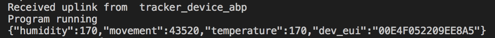

# Listener

## NodeJS

Node.js® is a JavaScript runtime built on [Chrome's V8 JavaScript engine](https://developers.google.com/v8/). Node.js uses an event-driven, non-blocking I/O model that makes it lightweight and efficient. Node.js' package ecosystem, [npm](https://www.npmjs.com/), is the largest ecosystem of open source libraries in the world.

## environment variables

When interacting with your server through a shell session, there are many pieces of information that your shell compiles to determine its behavior and access to resources. Some of these settings are contained within configuration settings and others are determined by user input.

One way that the shell keeps track of all of these settings and details is through an area it maintains called the **environment**. The environment is an area that the shell builds every time that it starts a session that contains variables that define system properties.

```text
TTN_APPID=
TTN_ACCESSKEY=

HTTP_HOST=
HTTP_PORT=
HTTP_PATH=
HTTP_HTTP=

```

##  the application



node server.js

