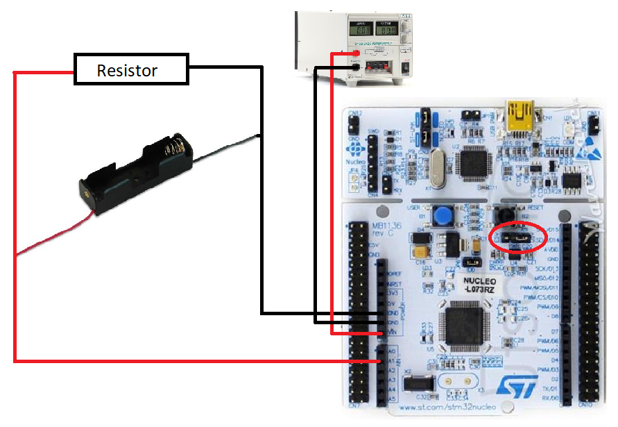
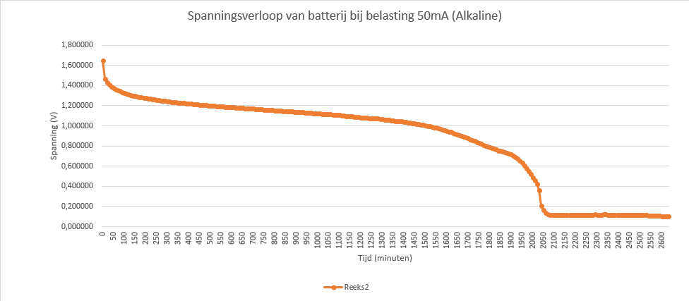
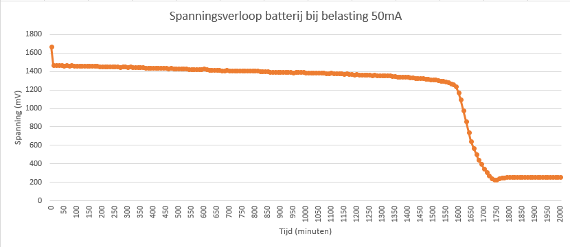
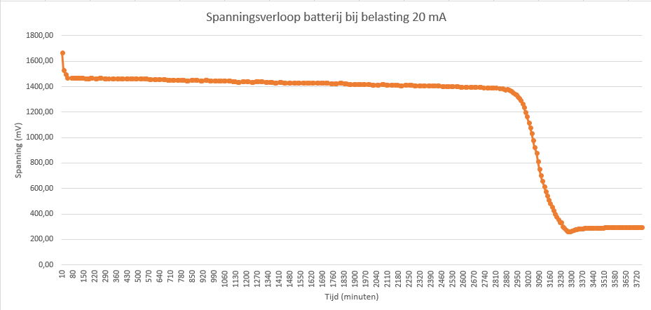

# Measurements on the battery

## About the battery

For this project it is necessary that we use a reliable battery. Wich means we need a battery that has a stable voltage and last as long as possible. But ofcourse it needs to be affordable.

Our choise was to use a " ENERGIZER L92". A lithium battery with a capacity of 1200 mAh. A lithium battery is known for the stable voltage it gives. It is more expensive than a alkine battery, but as you will see in de diagrams the difference will be to big to go for the "cheap ones".

## The measurements

### measuring setup



As you can see, there is a circuit with the battery and a resistor. The battery will provide the resistor from power and so the battery will run flat.

The microprocessor is fed by an external power supply, so its not necessary that there is connection with the pc while measuring. Its possible but not so praktical if you need your pc for other stuff. So we need to change the jumper 

### The program

The IC will measure the voltage every 10 minutes \(600 seconds\). It will store that value in an array. The values will also be plotted on the serial port so you're able to follow it real time also. When the measurement is done you can connect your laptop, push the button on the IC and the whole array will be plotted on the serial port. So you need tera term or something else to see those values. Once you have those value's you can  easily copy-paste them into excel and make charts of it.

!! **Make sure you make the array big enough to store all the measurements !!**

```text
#include "mbed.h"              
 
Serial pc(USBTX, USBRX); // tx, rx
AnalogIn analog_value(A1);
InterruptIn event(USER_BUTTON);

int print;
float huidigewaarde = 0;
float huidigeprintwaarde = 0;
int maxwaarden = 300;


void pressed()
{
     print = 1; 
}

int main() {   

float karakteristiekwaarden[maxwaarden];

    for(int i=0;i<maxwaarden;i++)
    {
        printf("opgemeten waarde %i", i);
        huidigewaarde = analog_value.read()*3.3;     
        printf(" bedraagt %f\n", huidigewaarde);
        karakteristiekwaarden[i] = huidigewaarde;
        wait(600);         
    }

    for(int j=0;j<maxwaarden;j++)
    {    
        huidigeprintwaarde = karakteristiekwaarden[j];
        printf("gemeten waarde = %f\n", huidigeprintwaarde);               
    }

    while (1)
    {
        event.fall(&pressed);
        
        if (print == 1)
        {
            for(int i=0;i<maxwaarden;i++)
            {    
                huidigeprintwaarde = karakteristiekwaarden[i];
                printf("gemeten waarde = %f\n", huidigeprintwaarde);               
            }
            print =0;
        }
    }
} 
```

### The charts

#### Alkalinebattery with load 50mA



#### Lithiumbattery with load 50mA



#### Lithiumbattery with load 20mA



