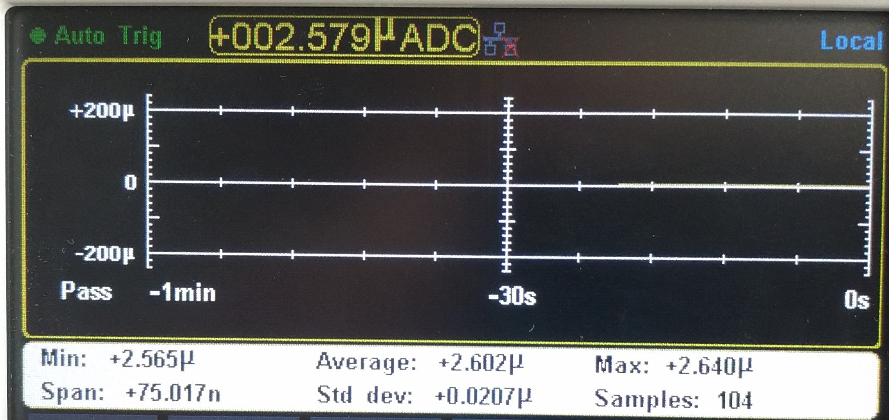

# Battery life

## Datasheets

You can find al the values that you need for calculating the lifetime of the PCB in the datasheets that are given below.

* PIR sensor \(Panasonic AMN31111\) 
  * [https://www.panasonic-electric-works.com/cps/rde/xbcr/pew\_eu\_en/ca\_pir\_motionsensors\_en.pdf](https://www.panasonic-electric-works.com/cps/rde/xbcr/pew_eu_en/ca_pir_motionsensors_en.pdf)
* Humidity & temperature sensor \(Si7012-A20\) 
  * [https://www.silabs.com/documents/public/data-sheets/Si7020-A20.pdf](https://www.silabs.com/documents/public/data-sheets/Si7020-A20.pdf)
* Processor \(STM32L476\) 
  * [https://www.digchip.com/datasheets/parts/datasheet/456/STM32L476-pdf.php](https://www.digchip.com/datasheets/parts/datasheet/456/STM32L476-pdf.php)
* LoRaWAN 
  * [http://www.hoperf.com/upload/rf/RFM95\_96\_97\_98W.pdf](http://www.hoperf.com/upload/rf/RFM95_96_97_98W.pdf)

## Measured values

### PIR sensor


The average current that we measured of the PIR is about 128 µA. In the datasheets you can read that the average current should be around 170 µA. Why? The environment condition could be different.


When you apply the power to the sensor it will take about 4.140 seconds to startup. This pattern was always the same in my environment \(no movement\)  
Afterwards the out will be zero if there is no movement. Otherwise you'll see pulses by every movement. Some pulses are longer than others. Because the sensor sees more movement or the object comes closer to the sensor.

### Humidity & temperature sensor


### Processor

#### Active mode


#### Sleep mode



The following code is an example to move the processor into a sleep mode. And this is equal to stop mode 2 as specified in the datasheets.

> Stop 2  mode : 1.4 µA w/RTC
>
> RTC = Real Time Clock




```cpp
#include "mbed.h"
void main(void) {
    sleep();
    while(true) {
    }
}
```




Make sure to implement the mbed.h file.


### LoRaWAN


We send a package with random data every 10 seconds. There can be an issue to send the packages, as you can see.

## Computation

Requirements:

* Measure for 2.5 seconds
* Transmit via LoRaWAN for 500 µs

A sample how we calculate the battery life.

First of all calculate the currencies that you need.


After that implement the time.


At least calculate the lifetime.


## Conclusion

With the requirements from above I calculated a battery life of 3.99 years theoretical and practical 1.29 years.

The values of the PIR, LoRaWAN and the processor were not exactly the same as in de datasheets.

