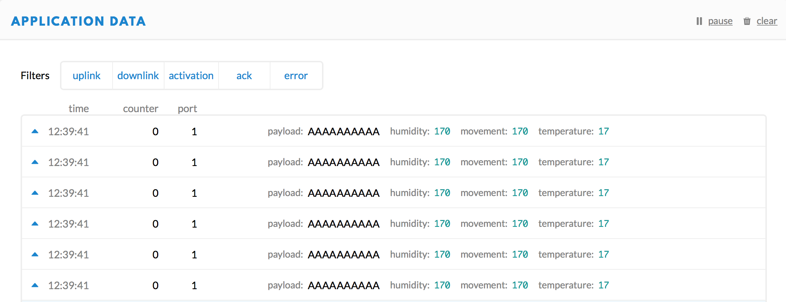

# The Things Network

We used The Things Network to monitor and manipulate the data we received from our mbed-based PCB. More information about The Things Network can be found on their site: [https://www.thethingsnetwork.org](https://www.thethingsnetwork.org)

## Setup

We made an application on TTN \(The Things Network\), and added a new device. Note that you have to make a new device in this application for every individual device/PCB. 

This image probably doesn't tell alot but here is our application:


Here you can see one of our devices:


A device had a few keys, these keys are unique for each devide. I think it's obvious that you can't give two PCB's the same keys.

We used OTAA \(over-the-air-activation\).  We use OTAA because it is the preferred and most secure way to connect with The Things Network. Devices perform a join-procedure with the network, during which a dynamic `DevAddr` is assigned and security keys are negotiated with the device.



## Payload Formats

Once the data has been sent via LoRaWAN from our PCB, it ends up in The Things Network. We have to somehow decode our rec eived data \(5 bytes\) into a form that is easily readable. This is done with the help of a `decoder`, which can be found under the 'Payload Formats' tab in the TTN console.

This is the decoder that we used. It is written in JavaScript, and it basically converts the five incomming bytes into a json string.

```javascript
function Decoder(bytes, port) {
// Decode an uplink message from a buffer
// (array) of bytes to an object of fields.
var decoded = {};

// Decode bytes to int
var temperature = bytes[0] | bytes[1];
var humidity = bytes[2];
var movement = bytes[3]*255+ bytes[4];

// Decode int to float
decoded.temperature = temperature;
decoded.humidity = humidity;
decoded.movement = movement;

return decoded;
}
```

A possible input could be: `00 15 1B 00 49`,  which than translates to:

```text
{
  "humidity": 27,
  "movement": 73,
  "temperature": 21
}
```


