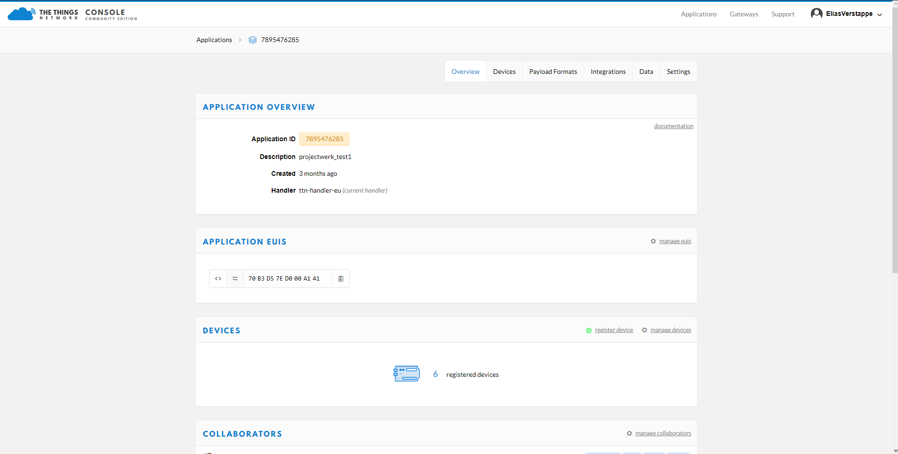

# The Things Network

We used The Things Network to monitor and manipulate the data we received from our mbed-based PCB. More information about The Things Network can be found on their site: [https://www.thethingsnetwork.org](https://www.thethingsnetwork.org)

We made an application on TTN \(The Things Network\), and added a new device. Note that you have to make a new device in this application for every individual device/PCB. 

Our application:

A device had a few keys, these keys are unique for each devide. I think it's obvious that you can't give two PCB's the same keys.

We used OTAA \(over-the-air-activation\).  We use OTAA because it is the preferred and most secure way to connect with The Things Network. Devices perform a join-procedure with the network, during which a dynamic `DevAddr` is assigned and security keys are negotiated with the device.

