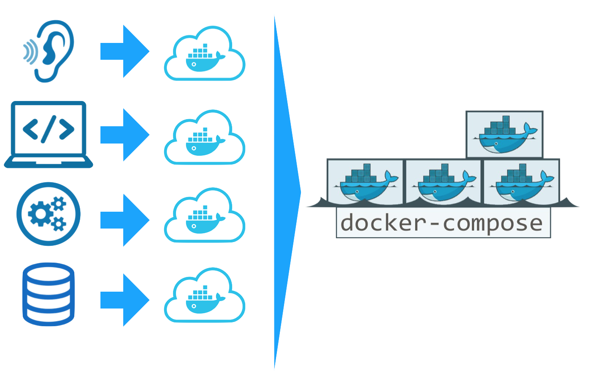

# Docker



## Docker-compose

Compose is a tool for defining and running multi-container Docker applications. With Compose, you use a YAML file to configure your application’s services. Then, with a single command, you create and start all the services from your configuration. To learn more about all the features of Compose, see [the list of features](https://docs.docker.com/compose/overview/#features).

```text
version: "3"services:version: "3"
services:
  frontend:
    image: projectwerk2/frontend:develop
    ports:
      - 80:5000
    restart: always
    environment:
     - REACT_APP_API_URL=http://192.168.99.100:8181
  backend:
    image: projectwerk2/backend
    ports:
      - 8181:8181
    environment:
      - APP_ENV=production
      - APP_KEY=${APP_KEY}
      - DB_HOST=database
      - DB_DATABASE=smartcampus
      - DB_USERNAME=smartcampus
      - DB_PASSWORD=smartcampus
    depends_on: 
      - database
    restart: always
  listener:
    image: projectwerk2/listener
    environment:
     - TTN_APPID=${TTN_APPID}
     - TTN_ACCESSKEY=${TTN_ACCESSKEY}
     - HTTP_HOST=backend
     - HTTP_PORT=8181
     - HTTP_PATH=/api/listener/
     - HTTP_HTTP=http
    restart: always
  database:
    image: mariadb
    environment:
     - MYSQL_ROOT_PASSWORD=smartcampus
     - MYSQL_DATABASE=smartcampus
     - MYSQL_USER=smartcampus
     - MYSQL_PASSWORD=smartcampus
    volumes:
     - database-data:/var/lib/mysql
    restart: always
volumes:
  database-data:
```

## Docker-compose file {#docker-compose-file}

Currently we can divide the file into 4 pieces `frontend, backend, listener` and `database.` these project have all different variables.

```text
image: projectwerk2/frontend:develop
```

First, tell Docker what image you want to build the `app` service from by specifying that you’ll be building from the `projectwerk2/frontend:develop` image.

```text
ports: 80:5000
```

Here, you’ve mapped port 80 on the host operating system, to port 5000 from the container. That way, when you’ve moved this container to a production host, users of the application can go to the host machine’s port 80 and have those requests answered from the container on port 5000.

```text
restart: always
```

Always restart the container if it stops.

```text
environment:
```

Docker lets you store data such as configuration settings, encryption keys, and external resource addresses in environment variables. Docker Cloud makes it easy to define, share, and update the environment variables for your services.

```text
volumes:
```

Volumes are the preferred mechanism for persisting data generated by and used by Docker containers. While [bind mounts](https://docs.docker.com/storage/bind-mounts/) are dependent on the directory structure of the host machine, volumes are completely managed by Docker. Volumes have several advantages over bind mounts:

## Environment variables {#environment-variables}

An **environment variable** is a dynamic "object" on a computer that stores a value, which in turn can be referenced by one or more software programs in Windows. Environment variables help programs know what directory to install files in, where to store temporary files, where to find user profile settings, and other things. It can be said that environment variables help to create and shape the environment of where a program runs.

```text
APP_KEY= 
TTN_APPID= 
TTN_ACCESSKEY=
```

you can store your **environment variable** in a **.env** file

## build your project.  {#build-your-project}

go the `smart-campus-docker-compose` file and open a **terminal**.

```text
docker-compose up
```

now your docker containers are **up and running** on your **localhost** or the ip addr Docker gave you with startup

```text
Starting smart-campus-docker-compose_listener_1 ... done 
Starting smart-campus-docker-compose_frontend_1 ... done 
Starting smart-campus-docker-compose_database_1 ... done 
Starting smart-campus-docker-compose_backend_1 ... done
```

You can inspect images with `docker inspect <tag or id>.`

`docker-compose` up without the `-d` option can also be used to spin up the services. The services will not be run in the background. Output of any of the containers will be shown in the terminal. Ending the terminal will also stop the containers from running.

Stop the application, either by running `docker-compose down` from within your project directory in the second terminal, or by hitting CTRL+C in the original terminal where you started the app.

```text

```

```text

```

