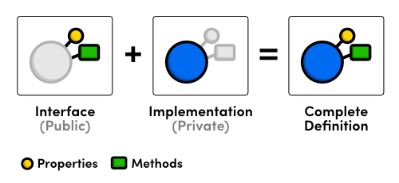
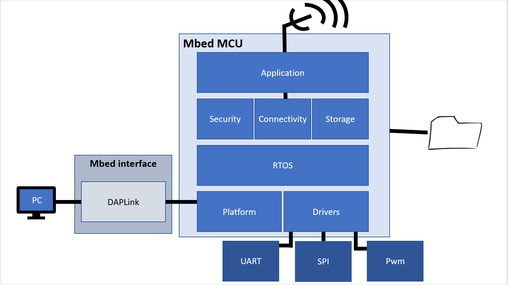

# Tasks of the Hardware Designers

The non-limited list of tasks of the hardware designers consists of the:

* development of a prototype using a processor and sensor boards;
* development of a custom battery powered PCB;
* development of the **mBed device drivers**;
* integration of the mBed firmware in **mBed OS**;
* communication with the software development team using the Agile **SCRUM** Software Development Methodology.

## Prototype

In an early stage, a fast proof-of-concept must be build using a prototype design. This design can be build using existing processor boards, breakout sensor boards and other pre-made hardware. This design will serve as a platform to test and develop firmware. In the next stage, a custom PCB with all the components must be build.

## Custom PCB

In the next stage, a custom PCB must be build using only the essential components. The PCB must also make use of battery power to operate, and must be optimized to run as long as possible. PCB's can be ordered online using a service like http://www.allpcb.com/ or an alternative service.

The PCB can be designed using the design software of your preference. We recommend [CircuitMaker](https://circuitmaker.com/), but [Eagle](https://www.autodesk.com/products/eagle/overview) is also a good option.

## mBed device drivers

The mBed device drivers should be developed according to the Object Oriented Paradigm \(OOP\), for instance in C++. As a good software developer you should create abstractions for all hardware. For each device that will be interfaced by the mBed, the driver software should be based on at least one **class**. A recommended approach is to divide the software in at least three sections: the **interface** \(e.g. GPSmodule.h\), the **implementation **\(e.g. GPSmodule.cpp\) and **application** \(e.g. GPStest.cpp\) \(see **image below**\).

## Integration of the mBed firmware in mBed OS

ARM mBed OS is an open source embedded operating system designed specifically for the "things" in the Internet of Things \(see **image below**\). It includes all the features you need to develop a connected product based on an ARM Cortex-M microcontroller, including security, connectivity, an RTOS (Real-Time Operating System) and drivers for sensors and I/O devices.

More info about mBed OS can be found at [https://os.mbed.com/](https://os.mbed.com/).

## Communication with the software development team

The team of hardware developers should meet/communicate on a regular basis with the software development team. The use of the iterative and incremental Agile software development methodology of **SCRUM** \(see **image below**\) is mandatory. One of the major contributors to the successful realization of a project is an intense, regular communication between the hardware and the software engineering teams. Detailed agreements on interfaces, connectors, communication protocols, pinout, ... are mandatory and fundamental to guarantee the successful realization of your project within a realistic period of time.

