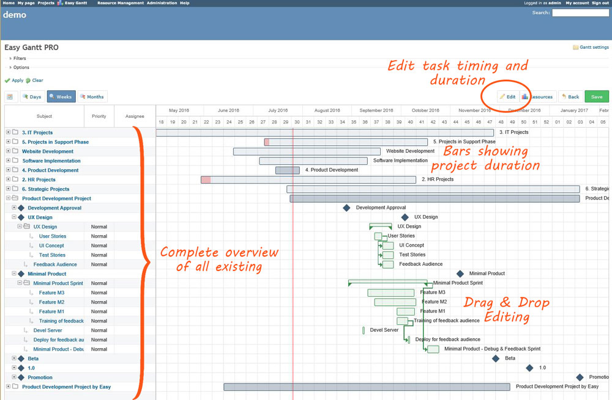
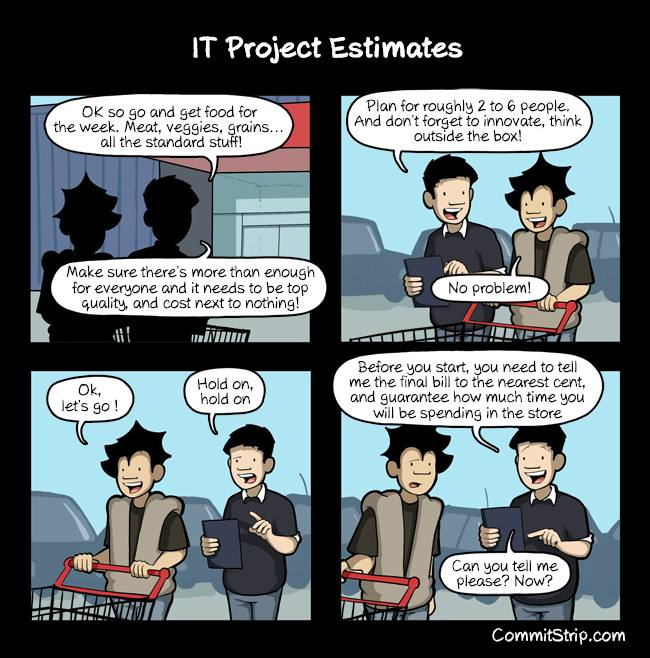
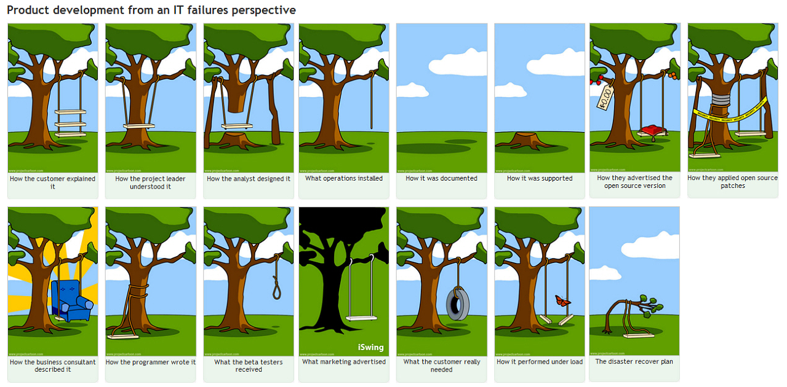

# Project Requirements

## Minimum requirements

The **minimum requirements** to be achieved in this project are:

* Three PCBs (occupation detector, temperature and humidity monitoring, smart signs)
 * Integrated LoRaWAN Communication
 * Ultra Low Power
* Drivers for all hardware
* mBed compatible firmware following the Object Oriented Paradigm
* A visually appealing dashboard
* A database management system at the back end
* An MQTT receiver service that populates the database

## Restrictions

<!-- * Battery must last for minimum 6 hours. Battery must stay in place when recharging through a USB connector.
* Use object oriented programming languages for both the firmware as software.
* Communication between the cases and the server must use the LoRaWAN communication protocol. -->

## Valuable expansions

<!-- * Updates, data or state can be send from the server to the cases.
* Multiple types of games, ranging from time, distance and difficulty can be created and played.
* Generate random games based on a set of restrictions
* Use your imagination and creativity. **Suggestions are welcome and will be appreciated**. -->

## Approach

The project could be subdivided in multiple major parts:

1. hardware
2. device drivers
3. firmware
4. database and database management system
5. visualization

Each topic must be subdivided into smaller topics. _Each student_ should be engaged in _at least one_ of these major project parts. If the sub-project, in which you are involved, is finished, you should join your colleagues to support their design team. Developers can switch teams when priorities shift during the project. After all, the success of the global project depends on each cooperator!

To meet the objectives of the project, some requirements are mandatory:

* Define and accept only **SMART** objectives \(Specific Measurable Acceptable Realistic Time Bound\)
* Plan Ahead, Plan wise. Therefore a Project Management System is the ideal support tool to enable this task. The project will be managed by **Redmine**.
* Efficient distribution and follow-up of tasks within the design team
* Agile **SCRUM** Software Development Methodology
* Efficient and streamlined communication between team members, peer-to-peer, bottom-up and top-down
* Peer assessment

## Agile Development SCRUM Methodology

The team of hardware developers should meet/communicate on a regular basis with the software development team. The use of the iterative and incremental Agile software development methodology of **SCRUM** \(see **image below**\) is mandatory. One of the major contributors to the successful realization of a project is an intense, regular communication between the hardware and the software engineering teams. Detailed agreements on interfaces, connectors, communication protocols, pinout, ... are mandatory and fundamental to guarantee the successful realization of your project within a realistic period of time.

## Git

All code and progress should be managed using Git. [github.com](https://github.com) can be used to create repositories and organize collaboration. Teachers should have full access to the projects, and projects should be public.

Note: Even failed experiments or code not used in the end result must be stored in Git repositories. **Code that has not been committed, is code that never existed. Ever!.**. Commits can be reverted, test code can be stored inside separate branches. You can even fork the project to experiment. There are multiple options.

## Redmine

URL: [http://project.labict.be/](http://project.labict.be/ "Redmine - Project Management System")

> **Redmine** is a flexible project management web application. Written using the Ruby on Rails framework, it is cross-platform and cross-database.

During this first session, a detailed planning must be made for the full length of time for the project. Each member must have at least one task assigned to himself at any moment during the development of the project.

At the end of each project day an evaluation will be made for each group based on the planning and logs of Redmine. Fine-tuning of the planning will be needed as the project advances to create a realistic picture of the progress and current state of the project.

> If it's not in the logs, it never happened !

## Slack

A slack channel "smart-campus" is created for this project. Preferable all communication and discussions should be done here if it does not concern to Redmine.

[https://eo-ict-vives.slack.com/messages/smart-campus/](https://eo-ict-vives.slack.com/messages/smart-campus/)

## Report

Reporting is done through this document on GitBook. It does have to adhere to a certain structure:

* index page with abstract and table of contents
* introduction
* actual content
* costings
* conclusions
* sources \(where you got your information\)
* attachments \(images, schematics, code, ...\) \(can be uploaded in documents / files\)

GitBook will be locked 1 week after the final presentation; so Wednesday the 30th of May 2018. This means you will not be able change anything anymore after this date.

## Final Presentation

The whole group should give a presentation of the final project in the last week. In this presentation you need to give an overview of the work performed and final result. External lectors and people may be attending this presentation and demonstration.

This presentation should include:

* 5 minutes presentation per person (every member of the group should take part in the final presentation)
* 10 minutes of demonstration
* 10 minutes of questions from the audience

Everything should be in English.

## Roadmap

* Wednesday 7/2 from 8h15 to 11h30 (in 2.85) and monitoraat from 14h45 to 17u45 (in 2.85)
* Wednesday 7/3 from 8h15 to 11h30 (in 2.85) and monitoraat from 14h45 to 17u45 (in 2.85)
* Wednesday 14/3 from 8h15 to 11h30 (in 2.85) and monitoraat from 14h30 to 15u30 (in 2.85)
* Friday 16/3 monitoraat from 15h45 to 17u45 (in 2.75)
* Wednesday 21/3 from 14h45 to 18u45 (in 2.85)
* Friday 23/3 from 15u45 to 17u45 (in 2.80)
* Thursday 29/3 from 8h15 to 11h30 (in 2.85)
* Thursday 19/4 monitoraat from 8u15 to 11u30 (in 2.85)
* Thursday 24/4 monitoraat from 13h30 to 16u30 - **not sure**
* Thursday 26/4 from 8h15 to 11h30 (in 2.85)
* Wednesday 2/5 monitoraat from 8u15 to 11u30 (in 2.65)
* Thursday 3/5 from 8u15 to 11u30 (in 2.85) monitoraat from 12u30 to 14u45 (in 2.85)
* Wednesday 9/5 monitoraat from 10u30 to 11u30 (in 2.65)
* Tuesday 15/05 monitoraat from 12u30 to 15u30 - **not sure**
* Tuesday 17/05 from 8u15 to 11u30 (in 2.85)
* Wednesday 23/5 from 8u15 to 11u30 (in 2.85) - **Final Presentation**

## Final notes

> "De enige plaats waar succes voor werk komt, is het woordenboek." \[Vidal Sassoon\] or in English "The only place where success comes before work, is in the dictionary.

<!-- How to split these lines? -->

> "Een expert is iemand die binnen een beperkt vakgebied alle mogelijke fouten heeft gemaakt."
> or in English "An expert is someone who made every mistake within his professional discipline.

As a matter of fact, your team should always avoid product development disasters, as presented in the following picture:

