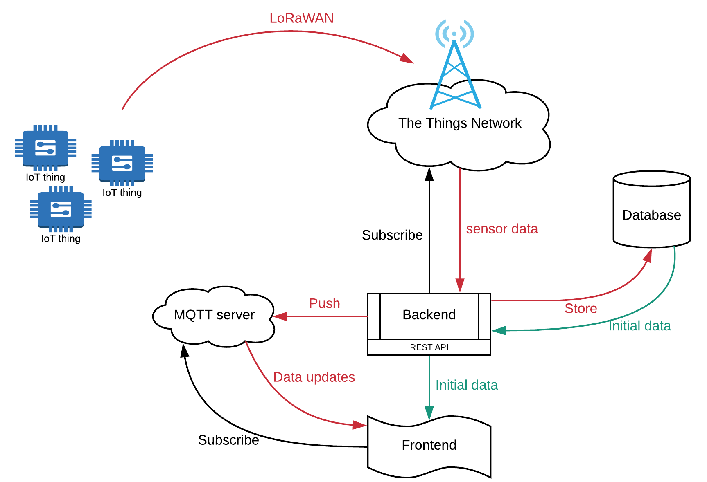
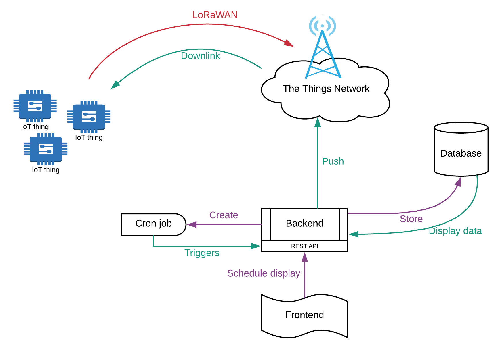
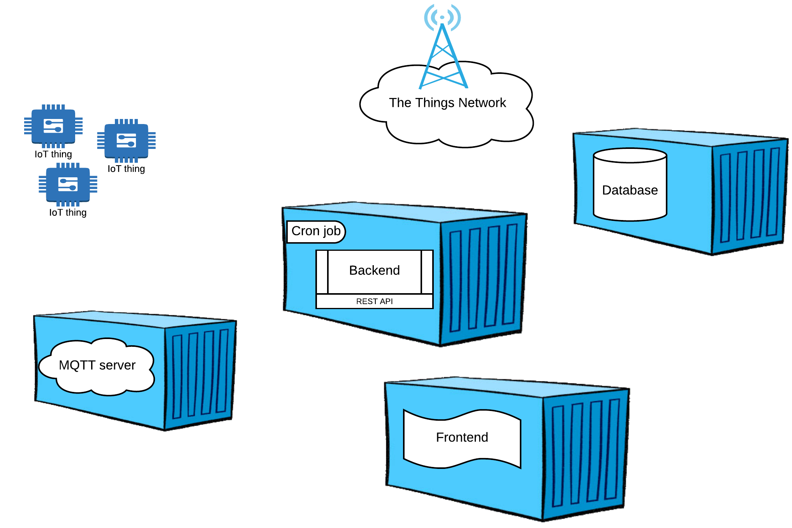

# Software Design

A good design will allow this project to grow to its full potential, namely a platform for creating a smart campus.

## Architecture

To get data from sensor to user, the following architecture can be used as a base.

Next to that the system should also allow the displays to be updated.

## Backend

The backend is the software that runs on the server. It will provide an interface REST API for the frontend to be able to manage all parameters and values of the application.

### NodeExpress / MVC framework

Any MVC framework could be used for this task. [Node Express](https://expressjs.com/) would be a nice candidate to fulfill this task.  The JavaScript language is perfect for these kinds of applications

## Frontend framework / View

The frontend framework is responsible for providing interactivity to the user in the browser. It will consist out of JavaScript framework that will manage all communication to the backend using the REST API. It will also make the application more dynamic and create the look and feel of an real application.

[Vue.js](https://vuejs.org/) is perfect candidate for this task. It is a modern and easy to use frontend framework, enabling the latest and best features for a rich application.

A CSS framework will be needed as well. [Materialize](http://materializecss.com/) could provide an App like experience to the end-users. Other frameworks could be used as will.

## MQTT

MQTT is a client-server publish/subscribe messaging transport protocol. It is light weight, open, simple, and designed so as to be easy to implement. These characteristics make it ideal for use in many situations, including constrained environments such as for communication in Machine to Machine (M2M) and Internet of Things (IoT) contexts where a small code footprint is required and/or network bandwidth is limited.

The hardware sensors will need to forward their data to The Things Network (TTN) via LoRaWAN. TTN provides an MQTT interface to which clients can subscribe to get data updates.

The backend will require an MQTT client service which transfers the data from TTN to both the database and your own MQTT server, where the pure data is pushed in a format of your own choosing (for example JSON). The TTN messages contain metadata which is of no concern for this application.

This setup also allows other clients (for example the front-end) to receive the data real-time.

Want to know more about MQTT then checkout [https://www.hivemq.com/mqtt-essentials/](https://www.hivemq.com/mqtt-essentials/).

### MQTT Server

An MQTT server can easily be hosted using Mosquitto. If configured correctly it can also be made available using websockets. By adding your own MQTT the project can work independent of existing infrastructure.

## Cron service

Cron is the name of program that enables Linux users to execute commands or scripts automatically at a specified time/date. A common use is a backup job or a cleanup of the database at scheduled times.

Cron jobs can be used to update the remote EInk displays with the necessary messages, scheduled by a user via the frontend.

## Database

To store all the historical data of the application, an database will be needed. Any kind of database could be up for this task. I may be useful to check out some NoSQL databases as well. For example [InfluxDB](https://www.influxdata.com/products/) is an ideal database to store sensor data in a time series.

A mix of two types databases could be used as well. Choose a database that is fit for the task.

## Docker

Docker is a service that allows the creation and running of containers based on images defined by developers. Containers package software into standardized units for development, shipment and deployment. A container image is a lightweight, stand-alone, executable package of a piece of software that includes everything needed to run it: code, runtime, system tools, system libraries, settings. Available for both Linux and Windows based apps, containerized software will always run the same, regardless of the environment. Containers isolate software from its surroundings, for example differences between development and staging environments and help reduce conflicts between teams running different software on the same infrastructure.

For this project all above components should be placed inside containers creating a clear separation and also allowing them to be hosted on any machine / server of our liking. So basically you need at least 4 container images. A server will be made available by us. Later on container hosting will also be provided by us.

## Unified Modeling Language

The **Unified Modeling Language** \(UML\) methodology could be very useful to manage, design and maintain the global and partial parts of the software project \(an example is shown in the image below\). In a transparent and clear manner the structure \(attributes and behavior\) and relations between classes is visualized. This is a rather powerful tool for supporting the process of software development.

The following UML diagrams should be used to explain the development and results:

* Class diagram
* User stories
* Sequence diagrams
* Flowcharts
* State diagram

Note: Free educational accounts can be requested at [Lucidchart.com](https://www.lucidchart.com/). Just google for "lucid charts educational account".

