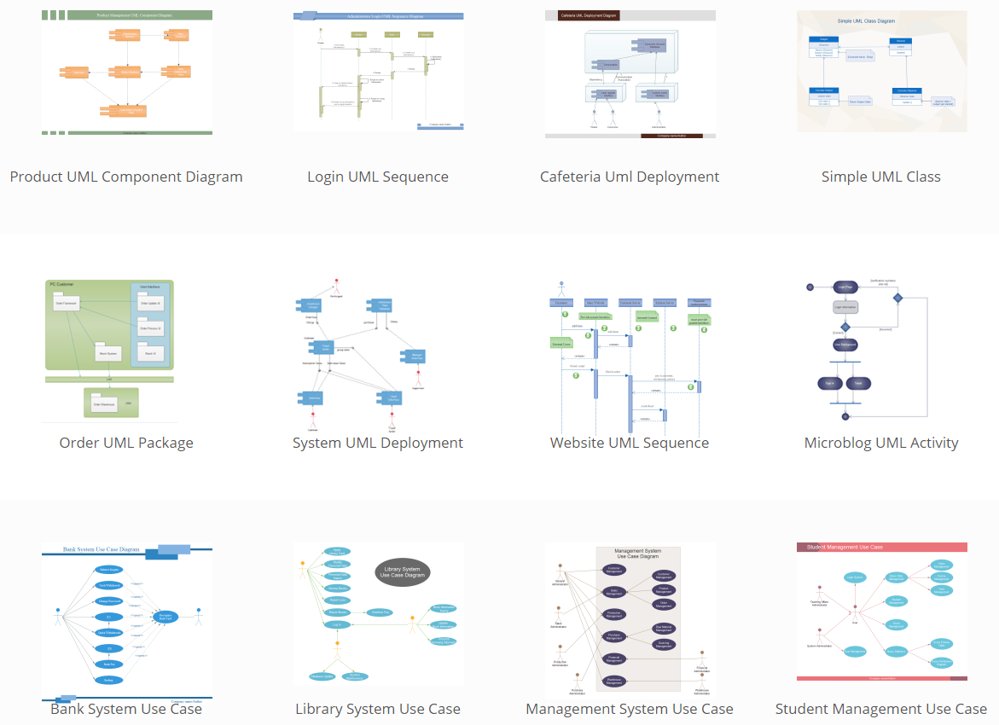

<!-- TODO: NEEDS UPDATE !!!!! -->

## Unified Modeling Language

The **Unified Modeling Language** \(UML\) methodology could be very useful to manage, design and maintain the global and partial parts of the software project \(an example is shown in the image below\). In a transparent and clear manner the structure \(attributes and behavior\) and relations between classes is visualized. This is a rather powerful tool for supporting the process of software development.

The following UML diagrams should be used to explain the development and results:

* Class diagram
* User stories
* Sequence diagrams
* Flowcharts
* State diagram

Note: Free educational accounts can be requested at [Lucidchart.com](https://www.lucidchart.com/). Just google for "lucid charts educational account".

