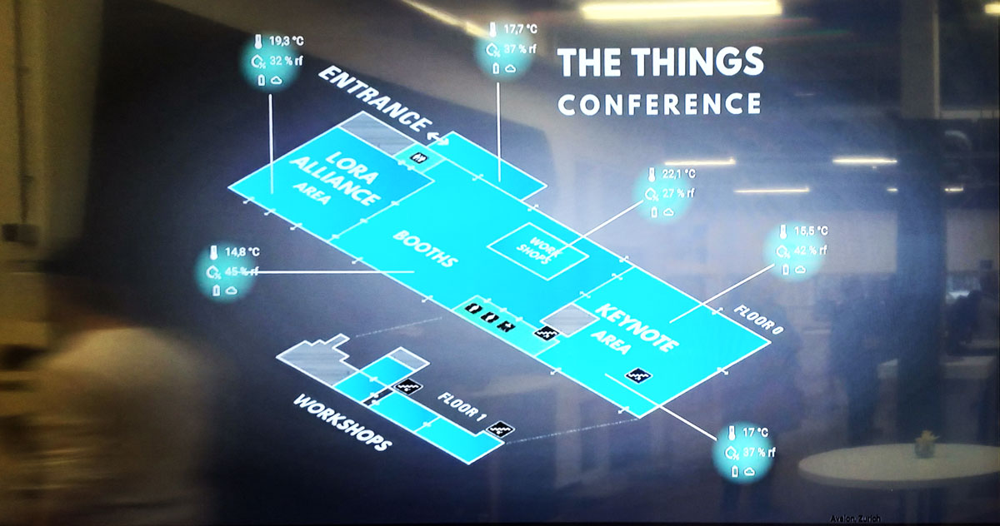

## User interface

A user interface will need to be build in order to do something usefull with the captured sensor data. This dashboard will inform any visitors and students with the various parameters that are measured.

At the other hand a managment the smart signs must be at hand. It must be possible to manage schedules for the different rooms, and update information about new workshops or give default information like the weather. An administrator must be able to mangage all these functions using a web interface.

### Management

The smart signs must al have a custom schedule that can be programmed by an administrator. He must be able to make changes to existing schedules. 

For events, the start, and endtimes must be provided to the signs. This enables a fully automatic system that has as less as possible time to maintain.

The managment part of the user interface will consist out of forms that enable CRUD actions. 

### Dashboard

An example of a dashboard could be as shown in the next picture. The picture shows a very visual layout of a building with the current sensor values visible for the different rooms.

Another view could be to show the historical data in the form of graphs and charts. The values of the last week, day or month could be displayed.

Another view that the dashboard may provide is a more detailed view of a single room. It could provide other types of charts or tables providing other ways to interprete the measurements and data.

## Backend

The backend is the software that runs on the server. It will provide an interface REST API for the frontend to be able to manage all parameters and values of the application. 

### NodeExpress / MVC framework

Any MVC framework could be used for this task. [Node Express](https://expressjs.com/) would be a nice candidate to forfill this task.  The JavaScript language is perfect for these kinds of applications

## Frontend framework / View

The frontend framework is responsible for providing interactivity to the user in the browser. It will consist out of JavaScript framework that will manage all communication to the backend using the REST API. It will also make the application more dynamic and create the look and feel of an real application.

[Vue.js](https://vuejs.org/) is perfect candidate for this task. It is a modern and easy to use frontend framework, enabling the latest en best features for a rich application.

A CSS framework will be needed as well. [Materialize](http://materializecss.com/) could provide an App like experience to the enduser. Other frameworks could be used as will.

## MQTT Client

## CRON service

<!-- For updating the displays -->

## Database

## Docker

Docker is a service that allows the creation and running of containers based on images defined by developers. Containers package software into standardized units for development, shipment and deployment. A container image is a lightweight, stand-alone, executable package of a piece of software that includes everything needed to run it: code, runtime, system tools, system libraries, settings. Available for both Linux and Windows based apps, containerized software will always run the same, regardless of the environment. Containers isolate software from its surroundings, for example differences between development and staging environments and help reduce conflicts between teams running different software on the same infrastructure.

For this project all above components should be placed inside containers creating a clear separation and also allowing them to be hosted on any machine / server of our liking. So basically you need at least 5 container images. A server will be made available by us. Later on container hosting will also be provided by us.

## Unified Modeling Language

The **Unified Modeling Language** \(UML\) methodology could be very useful to manage, design and maintain the global and partial parts of the software project \(an example is shown in the image below\). In a transparent and clear manner the structure \(attributes and behavior\) and relations between classes is visualized. This is a rather powerful tool for supporting the process of software development.

The following UML diagrams should be used to explain the development and results:

* Class diagram
* User stories
* Sequence diagrams
* Flowcharts
* State diagram

Note: Free educational accounts can be requested at [Lucidchart.com](https://www.lucidchart.com/). Just google for "lucid charts educational account".

