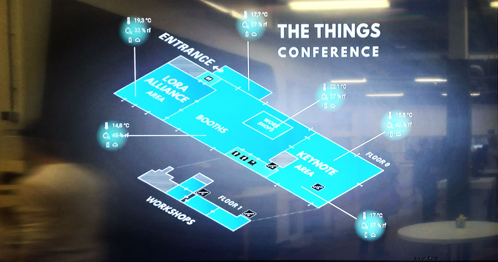
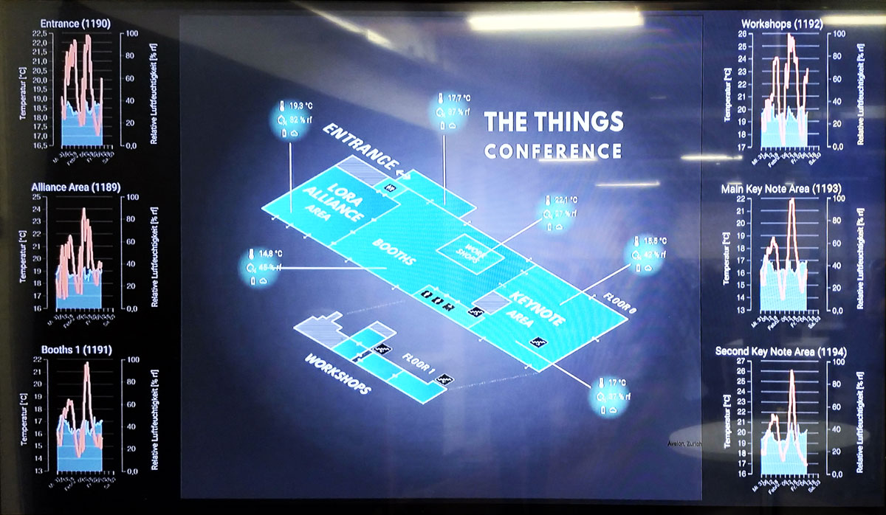
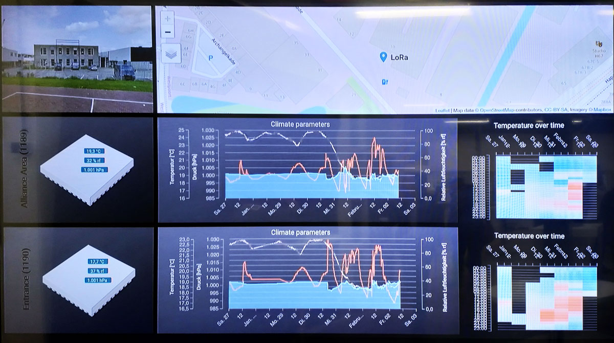

# Software Requirements

The dashboard should display a floorplan of the second floor containing an overview of the stats being measured. For example the temperature and movement inside a room can be displayed as an overlay over the map. The sensor data should also be displayed using graphs that display the data of at least a week.

Administrators should be able to schedule events to announce on the displays

## User interface

A user interface will need to be build in order to do something usefull with the captured sensor data. This dashboard will inform any visitors and students with the various parameters that are measured.

At the other hand a managment the smart signs must be at hand. It must be possible to manage schedules for the different rooms, and update information about new workshops or give default information like the weather. An administrator must be able to mangage all these functions using a web interface.

### Management

The smart signs must al have a custom schedule that can be programmed by an administrator. He must be able to make changes to existing schedules. 

For events, the start, and endtimes must be provided to the signs. This enables a fully automatic system that has as less as possible time to maintain.

The managment part of the user interface will consist out of forms that enable CRUD actions. 

### Dashboard

An example of a dashboard could be as shown in the next picture. The picture shows a very visual layout of a building with the current sensor values visible for the different rooms.

Another view could be to show the historical data in the form of graphs and charts. The values of the last week, day or month could be displayed.

Another view that the dashboard may provide is a more detailed view of a single room. It could provide other types of charts or tables providing other ways to interprete the measurements and data.

## Mobile first

The dashboard and managment interface should be developed with a 'mobile first' principle. This enables the monitoring and managment from any kind of device, such as smartphones and tablets. On the other hand large displays on desktop pc's and laptops must be supported as well.